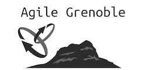

# Supports et slides des sessions présentées à la conférence Agile Grenoble 2018

## Journée du mercredi 14 novembre 2018

## Keynotes :

[Intelligence émotionnelle, comment développer son agilité ?](./slides/agilite_emotionnelle_ca_existe_CODEVAC.pdf) - Emmanuelle LE BRIS et Philippe CHIRADE

[Politique, politique, politique - Gérer vos relations professionnelles au travail](./slides/12_Secrets_for_Navigating_Politics.pdf) - Matthew Richter ([@MatthewSRichter](https://twitter.com/MatthewSRichter)) et Marion Ferlin

## Sessions :

[Agilité pour les Nuls](./slides/agilitepourlesnuls-2018.pdf) - Laurent Gay

[Revoir du code : grandeurs, décadence et apprentissage](./slides/Revoir_du_code.pdf) - Manuel Vacelet ([@vaceletm](https://twitter.com/@vaceletm))

[Help! Ma mère est un coach agile](./slides/HELP_Ma_mere_est_un_coach_agile.pdf) - Vanessa Humphreys

[TDD : la base pour faire du développement agile](./slides/TDD_Agile_Grenoble_2018.pdf) - Xavier Nopre ([@xnopre](https://twitter.com/@xnopre)) + code source : https://github.com/xnopre/tdd-demos/tree/tdd.agile-grenoble.2018

[L’agilité entre perruque de Monsieur Jourdain et casque de chantier](./slides/2018-Agile-Grenoble-Monsieur-Jourdain-V4.pdf) - Didier Lebouc ([@dlebouc](https://twitter.com/dlebouc)) 

[Améliorez-vous qu’ils disaient !](./slides/Ameliorez-vous-qu-ils-disaient.pdf) - Adrien Chantôme ([@AdrienChantome](https://twitter.com/AdrienChantome)) et Nicolas Thibert ([@ThibertNicolas](https://twitter.com/@ThibertNicolas))

[Etre agile en pleine pente](./slides/agile-en-pleine-pentes.ppt) - Remi Engelbrecht

[Intégrer l'ergonomie en milieu agile : plus compliqué qu'il n'y parait](./slides/UX_en_milieu_agile_MargauxPerrin_AgileGrenoble.pdf) - Margaux Perrin ([@Margauxlergo](https://twitter.com/@Margauxlergo)) 

[Manuel pratique de sabotage de transition devops](./slides/Sabootaaage_2018_v3.pdf) - Alain Delafosse ([@AlainDELAFOSSE](https://twitter.com/@AlainDELAFOSSE))
 
[Pour réussir vos ateliers, devenez facilitateur](./slides/Pour_reussir_vos_ateliers_devenez_facilitateur.pdf) - Grégory Alexandre ([@gregalexandre](https://twitter.com/@gregalexandre)) et Isabelle Gauthier ([@I_Gauthier](https://twitter.com/@I_Gauthier))

[Tour de gare réussi pour DIGISITE (SNCF) grâce à l'agilité](./slides/Conference_Agilite_DGIF_G_C.pptx) - Maxime Bonnet ([@maximebonnet](https://twitter.com/@maximebonnet)), William Anton et Vincent Chevalier

[Lego Team Wars](./slides/lego-team-wars/) - Laurent Eyraud ([@EyraudLaurent](https://twitter.com/@EyraudLaurent)) et Marc Nazarian ([@MarcNazarian](https://twitter.com/@MarcNazarian)) 

[L’atelier du Storymapping revisité](./slides/STORY_MAPPING_GAME-GRENOBLE_2018.pdf) - Patrick Comfaits ([@Mpcomfaits](https://twitter.com/pcomfaits)) et Alexis Leroy 
 
[Être un leader dans un monde agile](./slides/14_conseils_pour_Leaders.pdf) - Marion FERLIN et Matthew Richter ([@MatthewSRichter](https://twitter.com/MatthewSRichter))

[Les 10 secrets pour bien (re)démarrer dans l'agilité (et qui m'ont souvent sauvé)](./slides/2018.10.secrets.pdf) - Aurélien Morvant ([@AurelienMorvant](https://twitter.com/@AurelienMorvant)) 

## Journée du jeudi 15 novembre 2018

## Keynotes :

## Sessions :

[Agilité, Design et pensée systémique](./slides/Agilite_design_et_pensee_systemique.pdf) - Fabrice Liut ([@SlaapMe](https://twitter.com/@SlaapMe)) 

[Don't walk in my shu(s)!](./slides/Don_t_walk_in_my_shu-s-.pdf) - Xavier RENE-CORAIL ([@XCorail](https://twitter.com/@XCorail)) 

[Développez l’intelligence collective de vos équipes avec les “Liberating Structures”](./slides/Agile_Grenoble-Developpez_l_intelligence_collective_de_vos_equipes_avec_les_Liberating_Structures.pdf) - Anne Gabrillagues ([@agabrillagues](https://twitter.com/@agabrillagues)) 
 
[Management 3.0, des pratiques faciles et pas chères pour booster vos équipes](./slides/Managent_3.0.pdf) - Maxime Bonnet ([@maximebonnet](https://twitter.com/@maximebonnet)) 

[Les tests comme simplificateur de code](https://speakerdeck.com/martinsson/how-tests-simplify-code) - Johan Martinsson ([@johan_alps](https://twitter.com/@johan_alps))
 
[Kanban pour l'infra: le démarrage](./slides/Kanban_infra_rc4.pdf) - Alain Delafosse ([@AlainDELAFOSSE](https://twitter.com/@AlainDELAFOSSE))

[Des standups efficaces, pas si simple ...](./slides/Viveris-Standup-efficaces-pas-si-simple.pdf) - Adrien Chantôme ([@AdrienChantome](https://twitter.com/AdrienChantome)) et Nicolas Thibert ([@ThibertNicolas](https://twitter.com/@ThibertNicolas))

[Entre réalité et perception : est-ce si important d'avoir raison ?](./slides/Entre_realite_et_perception_est-ce_si_important_d_avoir_raison.pdf) - Olivier MY ([@OyoMy](https://twitter.com/@OyoMy)) 

[Si à 40 ans on n'est pas Manager c'est qu'on a raté sa vie !](./slides/Si_a_40_ans_on_n_est_pas_Manager_c_est_qu_on_a_rate_sa_vie.pdf) - Vanessa Humphreys

[ Penser autrement l'expression du besoin avec les Job Stories](./slides/Agile_Grenoble-Job_stories.pdf) - Anne Gabrillagues ([@agabrillagues](https://twitter.com/@agabrillagues)) 

[Product Owners, et si on se posait les bonnes questions](./slides/Product_Owners_et_si_on_se_posait_les_bonnes_questions.pdf) - Grégory Alexandre ([@gregalexandre](https://twitter.com/@gregalexandre))

[La DRH du futur sera agile ou ne sera pas](https://schd.ws/hosted_files/agilegrenoble2018/f2/RH%20AGILE%20GRENOBLE%2018_V1.2.pdf) - Nicolas Kalmanovitz ([@KalmanovitzN](https://twitter.com/@KalmanovitzN))
